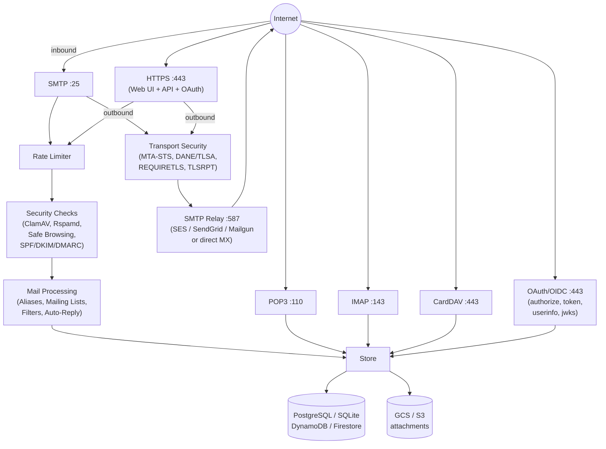
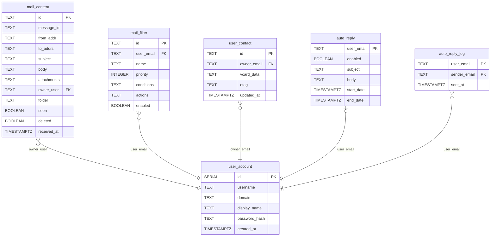
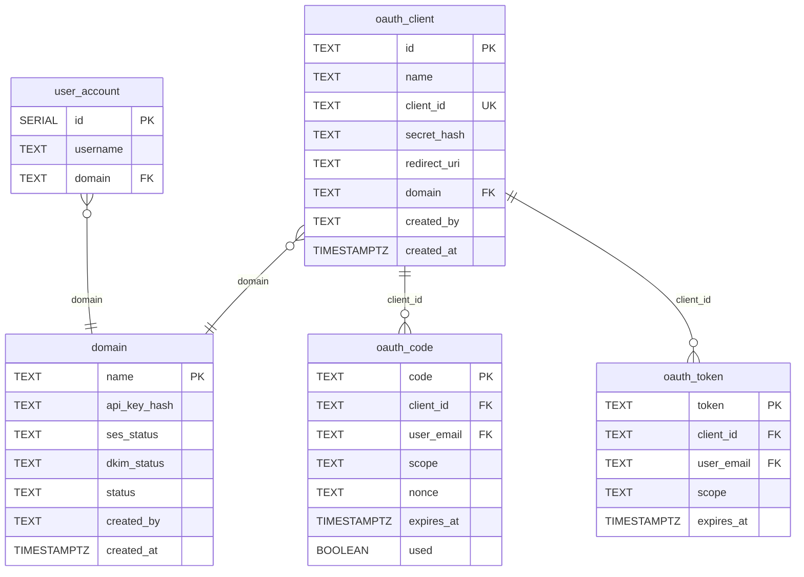
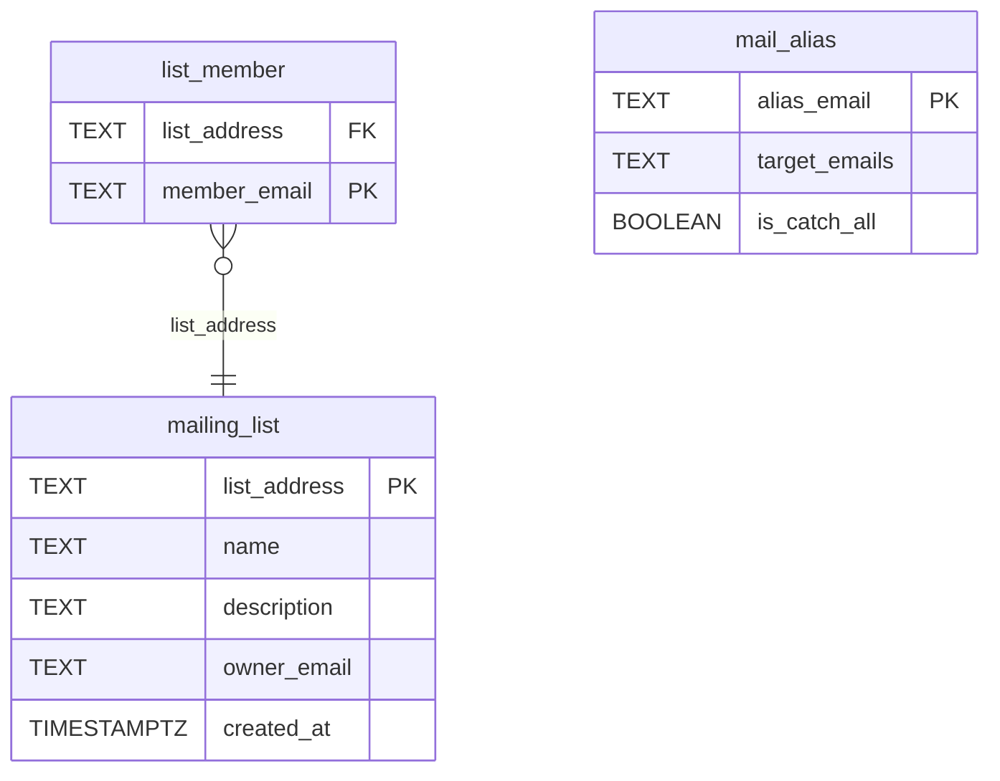

# BDS Mail

A multi-domain mail server written in Go. Single binary, zero required external dependencies. Supports SMTP, POP3, IMAP, and a web interface with pluggable cloud-native storage backends. Includes comprehensive email security: DKIM signing, SPF/DKIM/DMARC verification, MTA-STS, DANE/TLSA, TLSRPT, REQUIRETLS, ClamAV antivirus, Rspamd spam filtering, Google Safe Browsing, rate limiting, and automated TLS certificate management.

## Features

- **Multi-domain**: Serve multiple domains from a single instance (e.g. `domain1.com`, `domain2.com`)
- **Dual Web UI**: Server-rendered Go templates + Vue 3 SPA with JSON REST API
- **SMTP**: Receive inbound mail and relay outbound mail via MX lookup or external relay (SES, SendGrid, Mailgun)
- **POP3 & IMAP**: Mail client access (Thunderbird, Outlook, etc.)
- **Attachments**: Send and receive file attachments (MIME multipart), stored in GCS or S3
- **Reply / Forward**: Built-in reply, reply-all, forward with quoted body
- **Full-text search**: Search across subject, body, from, and to fields
- **Pagination**: 50 messages per page with navigation
- **Keyboard shortcuts**: `c` to compose from any page
- **Mobile responsive**: Works on phones and tablets
- **DKIM signing**: Outbound emails are cryptographically signed
- **Automated TLS**: Let's Encrypt certificates via certbot
- **SPF/DKIM/DMARC**: Inbound sender verification with policy-based reject/quarantine
- **MTA-STS / DANE / REQUIRETLS / TLSRPT**: Full outbound transport security
- **Virus scanning**: ClamAV integration (inbound and outbound)
- **Spam filtering**: Rspamd with configurable thresholds
- **Dangerous link detection**: Google Safe Browsing API
- **Rate limiting**: Per-IP connection limiting and brute-force login protection
- **Email aliases**: Forward to one or more targets, domain-level catch-all
- **Mailing lists**: Group distribution lists with List-Id headers
- **Server-side filtering**: Sieve-style rules with default presets
- **Auto-reply / Vacation**: Configurable with date ranges and cooldown
- **Contacts / CardDAV**: Web UI and protocol-level contact sync
- **OAuth 2.0 / OpenID Connect**: Built-in identity provider — "Sign in with yourdomain.com"
- **Developer portal**: Self-service OAuth app registration for third-party integrations
- **Admin panel**: Web UI for domains, users, aliases, and mailing lists
- **Dynamic domains**: Add domains on the fly without restart
- **Multiple databases**: PostgreSQL, SQLite, DynamoDB, or Firestore
- **Multiple object stores**: GCS or S3 for attachments

## Architecture



## Deployment Options

See [DEPLOYMENT.md](DEPLOYMENT.md) for detailed step-by-step instructions.

| Option | Stack | Monthly Cost |
|--------|-------|-------------|
| **AWS Lightsail + DynamoDB + SES** | Lightsail, DynamoDB (free tier), S3, SES | **~$6** |
| **GCP + Firestore + SES** | e2-micro, Firestore (free tier), GCS, SES | **~$10.50** |
| **GCP + Cloud SQL** | e2-micro, PostgreSQL, GCS, SES | **~$20.50** |
| **AWS EC2 + RDS** | t4g.micro, PostgreSQL, S3, SES | **~$22.30** |
| **Any VPS + SQLite** | Any $5 VPS, SQLite on disk | **~$6** |

SPA hosting (optional): Amplify (free tier), Firebase Hosting (free tier), or S3+CloudFront (~$0.50/month).

## Web Interface

Two interfaces served from the same server:

**Go Templates** (default at `/`) — Server-rendered, zero JS dependencies, works everywhere. Includes reply/forward, pagination, unread badges, keyboard shortcuts, mobile responsive.

**Vue 3 SPA** (at `/app/`) — Modern client-side app with Pinia state management, Vue Router, and Axios. Same features via JSON REST API at `/api/*`.

```bash
# Development
cd web/vue && npm install && npm run dev

# Production build
cd web/vue && npm run build   # Output served at /app/
```

## JSON REST API

All functionality is available via JSON endpoints at `/api/*`:

| Endpoint | Description |
|----------|-------------|
| `POST /api/auth/login` | Authenticate, returns user info |
| `GET /api/messages?folder=INBOX&page=1` | Paginated message list |
| `GET /api/messages/:id` | Message with body |
| `POST /api/compose` | Send message (multipart) |
| `GET /api/search?q=term` | Full-text search |
| `GET /api/folders` | User folder list |
| `GET /api/unread` | Unread count |
| `GET/POST /api/filters` | Manage mail filters |
| `GET/POST /api/autoreply` | Auto-reply settings |
| `GET/POST /api/contacts` | Contact management |
| `GET/POST /api/oauth/clients` | Developer portal (OAuth app registration) |
| `GET/POST /api/admin/*` | Admin operations (domains, users, aliases, lists) |

## OAuth 2.0 / OpenID Connect

bdsmail is an OIDC identity provider — enabling "Sign in with yourdomain.com" for any application.

### Flow

1. Developer registers app at `/developer` (gets `client_id` + `client_secret`)
2. App redirects user to `/oauth/authorize?client_id=...&redirect_uri=...&response_type=code&scope=openid email`
3. User authenticates and sees consent screen
4. bdsmail redirects back with authorization code
5. App exchanges code for `access_token` + `id_token` (JWT) at `/oauth/token`
6. App reads user identity from JWT or calls `/oauth/userinfo`

### Endpoints

| Endpoint | Description |
|----------|-------------|
| `/oauth/authorize` | Authorization (consent screen) |
| `/oauth/token` | Token exchange |
| `/oauth/userinfo` | User profile |
| `/oauth/jwks` | Public keys for JWT verification |
| `/.well-known/openid-configuration` | OIDC discovery |
| `/developer` | Self-service app registration |

### JWT Claims

`iss`, `sub`, `aud`, `email`, `name`, `domain`, `exp`, `iat`, `nonce`

## Security

All security features are **enabled by default** with a fail-open strategy.

| Layer | Features |
|-------|----------|
| **Connection** | Per-IP rate limiting, brute-force lockout |
| **Inbound** | ClamAV scan, SPF/DKIM/DMARC verify, Rspamd spam score, Safe Browsing URL check |
| **Outbound** | ClamAV scan, Safe Browsing check, DKIM signing |
| **Transport** | MTA-STS policy enforcement, DANE/TLSA verification, REQUIRETLS, TLSRPT reporting |
| **Auth** | Bcrypt passwords, session cookies, OAuth 2.0 with JWT |
| **Secrets** | CLI flags + SecretProvider (local JSON, AWS Secrets Manager, GCP Secret Manager) |

See [DEPLOYMENT.md](DEPLOYMENT.md) for security configuration details.

## Code Architecture

- **basis package** — Shared library (`github.com/mustafa-karli/basis`) for secrets, storage, logging, HTTP utilities
- **Interface Segregation** — Database split into `UserStore`, `MessageStore`, `AliasStore`, `FilterStore`, `ContactStore`, `DomainStore`, `OAuthStore` composed into `Database`
- **CLI flags** — All configuration via `flag` package, no `.env` file dependency. Secrets loaded via `SecretProvider` at startup
- **Domain table** — Domains stored in DB (not config file), with API key hash, SES/DKIM status, created_by
- **cryptoutil** — Shared crypto helpers for secure random generation and bcrypt hashing
- **Type-safe templates** — `pageData` uses concrete types (`[]*model.Message`, `[]*model.Filter`) instead of `interface{}`

## Mail Client Access

| Setting | Value |
|---------|-------|
| **IMAP** | `mail.yourdomain.com:143` (SSL/TLS) |
| **POP3** | `mail.yourdomain.com:110` (SSL/TLS) |
| **SMTP** | `mail.yourdomain.com:25` (STARTTLS) |
| **Username** | Full email: `user@yourdomain.com` |

## Email Features

**Aliases** — Forward to one or more targets. Catch-all with `@domain.com`. Managed at `/admin/aliases`.

**Mailing Lists** — Group distribution with `[ListName]` subject prefix and List-Id headers. Managed at `/admin/lists`.

**Filters** — Sieve-style rules: conditions (from/to/subject) + actions (move/mark read/delete/flag). Default presets for newsletters, social, noreply, large attachments.

**Auto-Reply** — Out-of-office with date ranges. 24-hour cooldown per sender. Skips noreply/mailer-daemon addresses.

**Contacts / CardDAV** — Web UI at `/contacts`. CardDAV at `/carddav/user@domain/default/` (macOS Contacts, DAVx5, Thunderbird CardBook).

**Admin** — Web panel at `/admin/` for domains, users, aliases, mailing lists. Protected by `BDS_ADMIN_SECRET`.

**Adding Domains** — `./bdsmail -adddomain newdomain.com` or via `/admin/domains`. Auto-generates DKIM keys, expands TLS cert, persists to `.env`.

---

## Data Model

### Mail & User Data



### Domain & OAuth



### Mailing Lists & Aliases


