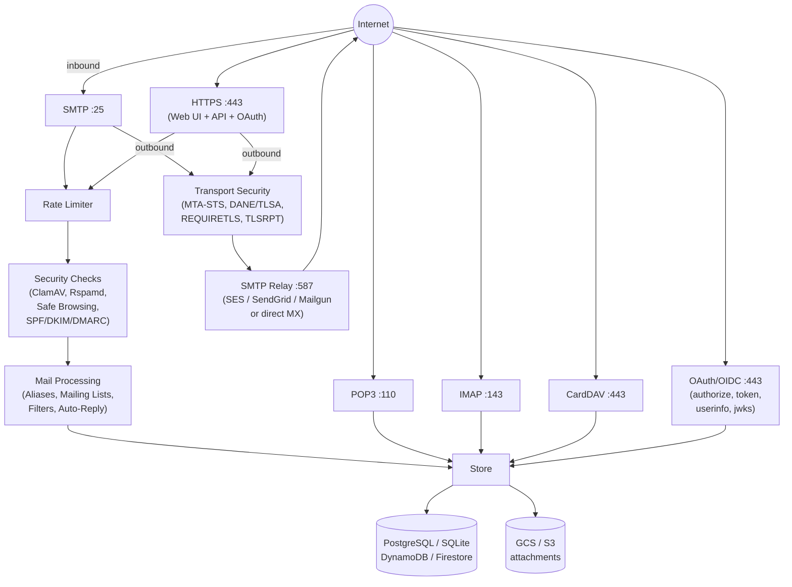
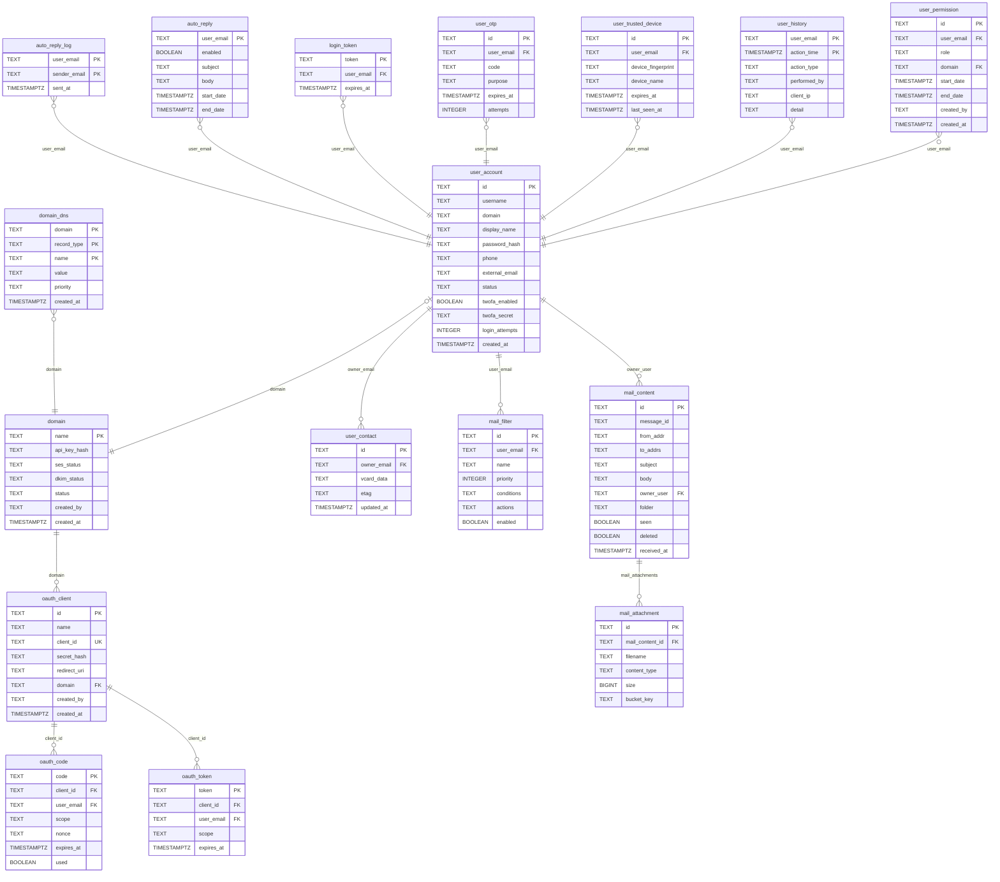
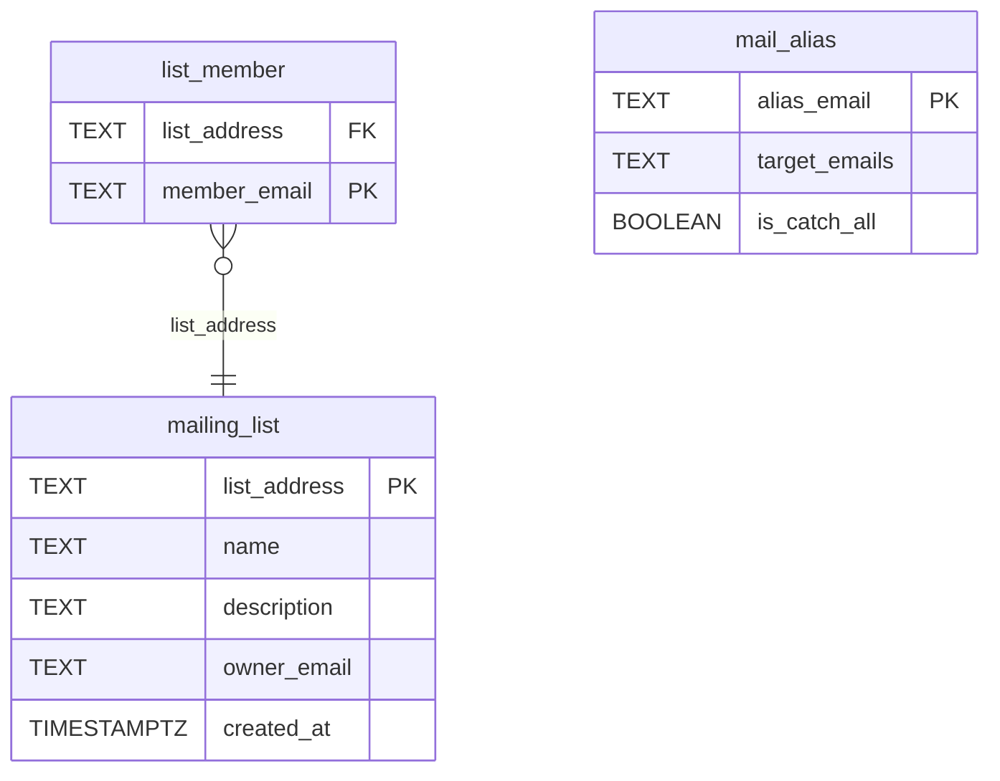

# BDS Mail

A multi-domain mail server written in Go. Single binary, zero required external dependencies. Supports SMTP, POP3, IMAP, and a web interface with pluggable cloud-native storage backends. Includes comprehensive email security: DKIM signing, SPF/DKIM/DMARC verification, MTA-STS, DANE/TLSA, TLSRPT, REQUIRETLS, ClamAV antivirus, Rspamd spam filtering, Google Safe Browsing, rate limiting, and automated TLS certificate management.

## Features

### Mail Protocols
- **SMTP** — Inbound and outbound email on port 25
- **POP3** — Mail client access on port 110
- **IMAP** — Mail client access on port 143 (Thunderbird, Outlook, Apple Mail)
- **External relay** — Outbound via Amazon SES, SendGrid, Mailgun, or direct MX

### Webmail
- **Dual Web UI** — Server-rendered Go templates + Vue 3 SPA with JSON REST API
- **Reply / Reply All / Forward** — Quoted body, pre-filled recipients
- **Attachments** — Send and receive file attachments (MIME multipart), stored in S3
- **Full-text search** — Search across subject, body, from, and to fields
- **Pagination** — 50 messages per page with navigation
- **Keyboard shortcuts** — `c` to compose from any page
- **Mobile responsive** — Works on phones and tablets
- **SVG icon nav bar** — Clean, icon-only navigation with tooltips

### Multi-Domain Platform
- **Multi-domain** — Serve hundreds of domains from a single instance
- **Self-service signup** — Users register at `mailsrv.bdscont.com/signup`, prove domain ownership via MX record, auto-provisioned
- **Shared mail hostname** — Customer MX/CNAME points to `mailsrv.bdscont.com`, change server IP once
- **Per-domain TLS** — SNI-based certificate management, independent issuance and renewal, zero downtime
- **Per-domain DKIM** — Unique RSA key pair per domain, auto-generated during registration
- **SES auto-verification** — Domain + DKIM verified in SES automatically during onboarding
- **DNS records persistence** — All DNS records saved in `domain_dns` table, viewable anytime by domain admin

### User Management
- **Role-based access** — Owner, Admin, User roles via `user_permission` table with start/end dates
- **Super admin** — Platform-wide administration at `mailsrv.bdscont.com/superadmin`
- **Domain user management** — Owner/admin creates, edits, suspends, activates users
- **Suspend / Activate** — No hard delete; suspended users can't login, mail still delivered
- **User history** — Full audit trail: login, failed login, suspend, activate, password change, role change with IP and timestamp

### Security
- **DKIM signing** — Outbound emails cryptographically signed per domain
- **SPF/DKIM/DMARC** — Inbound sender verification with policy-based reject/quarantine
- **MTA-STS (RFC 8461)** — Outbound TLS enforcement
- **DANE/TLSA (RFC 6698)** — Certificate verification via DNSSEC
- **REQUIRETLS (RFC 8689)** — End-to-end TLS enforcement
- **TLSRPT (RFC 8460)** — Daily TLS failure reports
- **ClamAV** — Virus scanning on inbound and outbound email
- **Rspamd** — Spam filtering with configurable reject/junk thresholds
- **Google Safe Browsing** — Malicious URL detection
- **Rate limiting** — Per-IP connection limiting and brute-force login protection
- **Two-factor authentication** — TOTP (Google Authenticator), backup codes, trusted devices (30-day bypass)
- **Automated TLS** — Let's Encrypt per-domain certs with daily renewal check

### Authentication & API
- **OAuth 2.0 / OpenID Connect** — Built-in identity provider: "Sign in with yourdomain.com"
- **Developer portal** — Self-service OAuth app registration with client_id/secret
- **JWT ID tokens** — RS256-signed with email, name, domain claims
- **App tokens for sending email** — REST API at `/api/send` with bearer token, per-sender authorization
- **API keys management** — Domain admins create/revoke app tokens at `/settings/api-keys`
- **JSON REST API** — Full API at `/api/*` for all operations (messages, contacts, filters, users, domains)

### Email Features
- **Email aliases** — Forward to one or more targets, domain-level catch-all
- **Mailing lists** — Group distribution with List-Id/List-Unsubscribe headers
- **Server-side filtering** — Sieve-style rules with default presets (newsletters, social, noreply, large attachments)
- **Auto-reply / Vacation** — Configurable with date ranges and 24-hour per-sender cooldown
- **Contacts / CardDAV** — Web UI and CardDAV protocol (macOS Contacts, DAVx5, Thunderbird CardBook)

### Infrastructure
- **Single Go binary** — ~75MB, zero runtime dependencies
- **Hetzner VPS** — CX22 (2 vCPU, 4GB RAM, 40GB NVMe) for ~€4.50/mo
- **PostgreSQL 18** — Self-hosted, tuned for 4GB RAM
- **Cloudflare R2** — S3-compatible attachment + backup storage (10GB free)
- **SendGrid** — Outbound email relay (100/day free, no approval needed)
- **Cloudflare DNS** — Free plan with DNS-only mode for mail subdomains
- **CLI flags + SecretProvider** — No .env file; secrets via local JSON or cloud secret managers
- **Shared library (basis)** — Reuses `github.com/mustafa-karli/basis` for secrets, HTTP utilities
- **Daily backups** — pg_dump to R2 via rclone, 7-day local / 30-day remote rotation
- **Daily cert renewal** — Per-domain Let's Encrypt certs, auto-renewed

## Architecture



---

## How To

### Send Email from Your Application (REST API)

Create an API key at `/settings/api-keys`, then call `/api/send` with a bearer token.

**Go:**
```go
// Load API key from secrets
apiKey := secrets.Get("bdsmail_api_key") // e.g. "bds_ak_a1b2c3..."

func sendEmail(to, subject, body string) error {
    payload, _ := json.Marshal(map[string]any{
        "to":      []string{to},
        "subject": subject,
        "body":    body,
    })
    req, _ := http.NewRequest("POST", "https://mail.yourdomain.com/api/send", bytes.NewReader(payload))
    req.Header.Set("Authorization", "Bearer "+apiKey)
    req.Header.Set("Content-Type", "application/json")
    resp, err := http.DefaultClient.Do(req)
    if err != nil {
        return err
    }
    defer resp.Body.Close()
    if resp.StatusCode != 200 {
        return fmt.Errorf("send failed: %d", resp.StatusCode)
    }
    return nil
}

// Usage
sendEmail("newuser@gmail.com", "Verify your account", "Click here: https://app.yourdomain.com/verify?token=abc123")
```

**Node.js / TypeScript:**
```javascript
const BDSMAIL_API = 'https://mail.yourdomain.com/api/send';
const API_KEY = process.env.BDSMAIL_API_KEY; // bds_ak_a1b2c3...

async function sendEmail(to, subject, body) {
  const res = await fetch(BDSMAIL_API, {
    method: 'POST',
    headers: {
      'Authorization': `Bearer ${API_KEY}`,
      'Content-Type': 'application/json',
    },
    body: JSON.stringify({ to: [to], subject, body }),
  });
  if (!res.ok) throw new Error(`Send failed: ${res.status}`);
  return res.json();
}

// Usage
await sendEmail('newuser@gmail.com', 'Welcome!', 'Thanks for signing up.');
```

**Python:**
```python
import requests, os

API_KEY = os.environ['BDSMAIL_API_KEY']  # bds_ak_a1b2c3...

def send_email(to, subject, body):
    r = requests.post('https://mail.yourdomain.com/api/send',
        headers={'Authorization': f'Bearer {API_KEY}'},
        json={'to': [to], 'subject': subject, 'body': body})
    r.raise_for_status()
    return r.json()

# Usage
send_email('newuser@gmail.com', 'Verify your account', 'Click the link to verify...')
```

**cURL:**
```bash
curl -X POST https://mail.yourdomain.com/api/send \
  -H "Authorization: Bearer bds_ak_YOUR_API_KEY" \
  -H "Content-Type: application/json" \
  -d '{
    "to": ["user@example.com"],
    "subject": "Welcome!",
    "body": "<h1>Welcome</h1><p>Thanks for signing up.</p>",
    "html": true
  }'
```

### Send Email from Your Application (SMTP with App Token)

Use the same API key as SMTP password. Works with any SMTP library — no REST API needed.

**Go:**
```go
import "net/smtp"

apiKey := secrets.Get("bdsmail_api_key") // "bds_ak_a1b2c3..."

auth := smtp.PlainAuth("", "noreply@yourdomain.com", apiKey, "mail.yourdomain.com")
err := smtp.SendMail("mail.yourdomain.com:25", auth,
    "noreply@yourdomain.com",
    []string{"user@gmail.com"},
    []byte("From: noreply@yourdomain.com\r\nTo: user@gmail.com\r\nSubject: Welcome\r\n\r\nThanks for signing up!"),
)
```

**Node.js (nodemailer):**
```javascript
const nodemailer = require('nodemailer');

const transport = nodemailer.createTransport({
  host: 'mail.yourdomain.com',
  port: 25,
  auth: {
    user: 'noreply@yourdomain.com',
    pass: process.env.BDSMAIL_API_KEY,  // bds_ak_a1b2c3...
  },
});

await transport.sendMail({
  from: 'noreply@yourdomain.com',
  to: 'user@gmail.com',
  subject: 'Welcome!',
  text: 'Thanks for signing up.',
});
```

**Python:**
```python
import smtplib, os
from email.message import EmailMessage

msg = EmailMessage()
msg['From'] = 'noreply@yourdomain.com'
msg['To'] = 'user@gmail.com'
msg['Subject'] = 'Welcome!'
msg.set_content('Thanks for signing up.')

with smtplib.SMTP('mail.yourdomain.com', 25) as s:
    s.login('noreply@yourdomain.com', os.environ['BDSMAIL_API_KEY'])
    s.send_message(msg)
```

> **Tip:** The same `bds_ak_...` key works for both REST API (`/api/send`) and SMTP AUTH. Create one key at `/settings/api-keys` and use it either way.

### Add "Sign in with yourdomain.com" to Your App (OAuth 2.0)

Register an OAuth app at `/developer`, then implement the standard authorization code flow.

**Step 1: Redirect user to bdsmail**
```javascript
// Frontend — redirect to authorize
const clientId = 'YOUR_CLIENT_ID';
const redirectUri = 'https://yourapp.com/callback';
window.location = `https://mail.yourdomain.com/oauth/authorize?` +
  `client_id=${clientId}&redirect_uri=${encodeURIComponent(redirectUri)}` +
  `&response_type=code&scope=openid email`;
```

**Step 2: Exchange code for tokens (server-side)**
```javascript
// Backend — handle /callback
app.get('/callback', async (req, res) => {
  const { code } = req.query;
  const tokenRes = await fetch('https://mail.yourdomain.com/oauth/token', {
    method: 'POST',
    headers: { 'Content-Type': 'application/x-www-form-urlencoded' },
    body: new URLSearchParams({
      grant_type: 'authorization_code',
      code,
      client_id: CLIENT_ID,
      client_secret: CLIENT_SECRET,
      redirect_uri: 'https://yourapp.com/callback',
    }),
  });
  const { access_token, id_token } = await tokenRes.json();

  // id_token is a JWT with: email, name, domain
  const user = JSON.parse(atob(id_token.split('.')[1]));
  // user = { sub: "alice@yourdomain.com", email: "...", name: "alice", domain: "yourdomain.com" }
});
```

**Step 3: Get user info (optional)**
```bash
curl https://mail.yourdomain.com/oauth/userinfo \
  -H "Authorization: Bearer ACCESS_TOKEN"
# Returns: { "sub": "alice@yourdomain.com", "email": "...", "name": "alice", "domain": "yourdomain.com" }
```

### Register a New Domain (Self-Service)

1. Go to `https://mailsrv.bdscont.com/signup`
2. Enter domain name, username, display name, password
3. Add the 5 DNS records shown (CNAME, MX, SPF, DMARC, bounce SPF)
4. Click **Verify** — bdsmail checks MX record, provisions everything automatically
5. Login and start using email

### Add Users to Your Domain

1. Login as domain owner/admin
2. Go to **Users** (people icon in nav bar)
3. Enter username, display name, password, role
4. Click **Add**

Roles: **Owner** (full control), **Admin** (manage users/settings), **User** (mailbox only)

### Create an API Key for Your Application

1. Login as domain owner/admin
2. Go to **API Keys** (key icon in nav bar)
3. Enter a name (e.g. "Registration App") and sender email (e.g. `noreply@yourdomain.com`)
4. Click **Create**
5. **Copy the key** — it's shown only once: `bds_ak_a1b2c3d4...`

### Configure a Mail Client (Thunderbird, Outlook, etc.)

| Setting | Value |
|---------|-------|
| **IMAP** | `mail.yourdomain.com:143` (SSL/TLS) |
| **POP3** | `mail.yourdomain.com:110` (SSL/TLS) |
| **SMTP** | `mail.yourdomain.com:25` (STARTTLS) |
| **Username** | Full email: `user@yourdomain.com` |

### Enable Two-Factor Authentication

1. Go to **2FA** (lock icon in nav bar)
2. Click **Enable 2FA**
3. Scan QR code with Google Authenticator / Authy
4. Save the 10 backup codes (shown once)
5. Next login requires a 6-digit code from the authenticator app
6. Optionally trust the device for 30 days

---

## Deployment

See [DEPLOYMENT.md](DEPLOYMENT.md) for detailed step-by-step instructions.

| Component | Service | Cost |
|-----------|---------|------|
| Compute | Hetzner CX22 (2 vCPU, 4GB RAM) | €4.50/mo |
| Database | Self-hosted PostgreSQL 18 | $0 |
| Attachments + Backups | Cloudflare R2 (S3-compatible) | $0 (10GB free) |
| Outbound email | SendGrid (100/day free) | $0 |
| DNS + CDN | Cloudflare | $0 |
| TLS | Let's Encrypt (per-domain SNI) | $0 |
| **Total** | | **~$5/month** |

## Web Interface

Two interfaces served from the same server:

**Go Templates** (default at `/`) — Server-rendered, zero JS dependencies, works everywhere. Includes reply/forward, pagination, unread badges, keyboard shortcuts, mobile responsive.

**Vue 3 SPA** (at `/app/`) — Modern client-side app with Pinia state management, Vue Router, and Axios. Same features via JSON REST API at `/api/*`.

```bash
# Development
cd web/vue && npm install && npm run dev

# Production build
cd web/vue && npm run build   # Output served at /app/
```

## JSON REST API

All functionality is available via JSON endpoints at `/api/*`:

| Endpoint | Description |
|----------|-------------|
| `POST /api/auth/login` | Authenticate, returns user info |
| `GET /api/messages?folder=INBOX&page=1` | Paginated message list |
| `GET /api/messages/:id` | Message with body |
| `POST /api/compose` | Send message (multipart) |
| `GET /api/search?q=term` | Full-text search |
| `GET /api/folders` | User folder list |
| `GET /api/unread` | Unread count |
| `GET/POST /api/filters` | Manage mail filters |
| `GET/POST /api/autoreply` | Auto-reply settings |
| `GET/POST /api/contacts` | Contact management |
| `GET/POST /api/oauth/clients` | Developer portal (OAuth app registration) |
| `GET/POST /api/admin/*` | Admin operations (domains, users, aliases, lists) |

## OAuth 2.0 / OpenID Connect

bdsmail is an OIDC identity provider — enabling "Sign in with yourdomain.com" for any application.

### Flow

1. Developer registers app at `/developer` (gets `client_id` + `client_secret`)
2. App redirects user to `/oauth/authorize?client_id=...&redirect_uri=...&response_type=code&scope=openid email`
3. User authenticates and sees consent screen
4. bdsmail redirects back with authorization code
5. App exchanges code for `access_token` + `id_token` (JWT) at `/oauth/token`
6. App reads user identity from JWT or calls `/oauth/userinfo`

### Endpoints

| Endpoint | Description |
|----------|-------------|
| `/oauth/authorize` | Authorization (consent screen) |
| `/oauth/token` | Token exchange |
| `/oauth/userinfo` | User profile |
| `/oauth/jwks` | Public keys for JWT verification |
| `/.well-known/openid-configuration` | OIDC discovery |
| `/developer` | Self-service app registration |

### JWT Claims

`iss`, `sub`, `aud`, `email`, `name`, `domain`, `exp`, `iat`, `nonce`

## Security

All security features are **enabled by default** with a fail-open strategy.

| Layer | Features |
|-------|----------|
| **Connection** | Per-IP rate limiting, brute-force lockout |
| **Inbound** | ClamAV scan, SPF/DKIM/DMARC verify, Rspamd spam score, Safe Browsing URL check |
| **Outbound** | ClamAV scan, Safe Browsing check, DKIM signing |
| **Transport** | MTA-STS policy enforcement, DANE/TLSA verification, REQUIRETLS, TLSRPT reporting |
| **Auth** | Bcrypt passwords, TOTP 2FA, backup codes, trusted devices, session cookies, OAuth 2.0 with JWT |
| **Secrets** | CLI flags + SecretProvider (local JSON, AWS Secrets Manager, GCP Secret Manager) |

See [DEPLOYMENT.md](DEPLOYMENT.md) for security configuration details.

## Code Architecture

- **basis package** — Shared library (`github.com/mustafa-karli/basis`) for secrets, storage, logging, HTTP utilities
- **Interface Segregation** — Database split into `UserStore`, `MessageStore`, `AliasStore`, `FilterStore`, `ContactStore`, `DomainStore`, `OAuthStore` composed into `Database`
- **CLI flags** — All configuration via `flag` package, no `.env` file dependency. Secrets loaded via `SecretProvider` at startup
- **Domain table** — Domains stored in DB (not config file), with API key hash, SES/DKIM status, created_by
- **cryptoutil** — Shared crypto helpers for secure random generation and bcrypt hashing
- **Type-safe templates** — `pageData` uses concrete types (`[]*model.Message`, `[]*model.Filter`) instead of `interface{}`

## Mail Client Access

| Setting | Value |
|---------|-------|
| **IMAP** | `mail.yourdomain.com:143` (SSL/TLS) |
| **POP3** | `mail.yourdomain.com:110` (SSL/TLS) |
| **SMTP** | `mail.yourdomain.com:25` (STARTTLS) |
| **Username** | Full email: `user@yourdomain.com` |

## Email Features

**Aliases** — Forward to one or more targets. Catch-all with `@domain.com`. Managed at `/admin/aliases`.

**Mailing Lists** — Group distribution with `[ListName]` subject prefix and List-Id headers. Managed at `/admin/lists`.

**Filters** — Sieve-style rules: conditions (from/to/subject) + actions (move/mark read/delete/flag). Default presets for newsletters, social, noreply, large attachments.

**Auto-Reply** — Out-of-office with date ranges. 24-hour cooldown per sender. Skips noreply/mailer-daemon addresses.

**Contacts / CardDAV** — Web UI at `/contacts`. CardDAV at `/carddav/user@domain/default/` (macOS Contacts, DAVx5, Thunderbird CardBook).

**Admin** — Web panel at `/admin/` for domains, users, aliases, mailing lists. Protected by `BDS_ADMIN_SECRET`.

**Adding Domains** — `./bdsmail -adddomain newdomain.com` or via `/admin/domains`. Auto-generates DKIM keys, expands TLS cert, persists to `.env`.

---

## Data Model

### Mail & User Data



### Mailing Lists & Aliases


